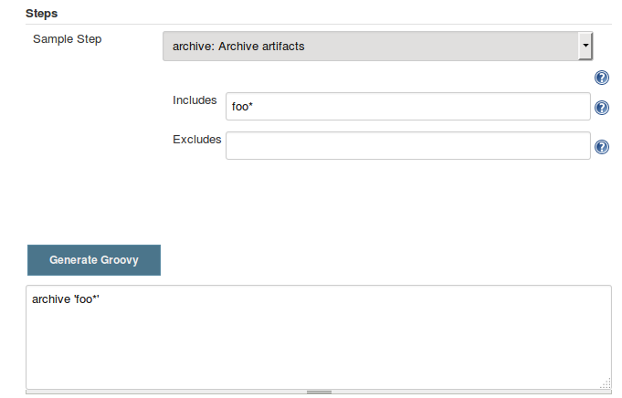
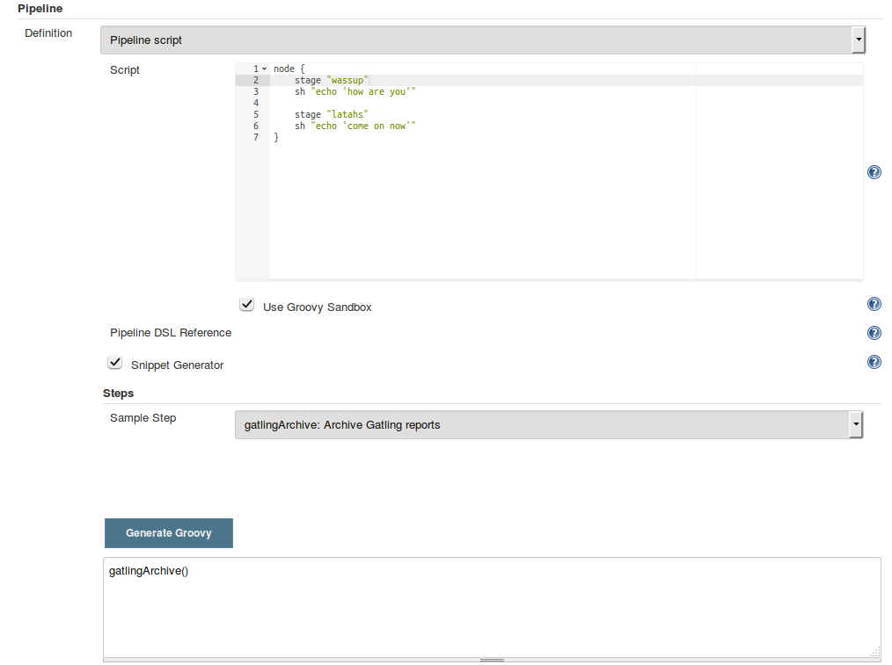
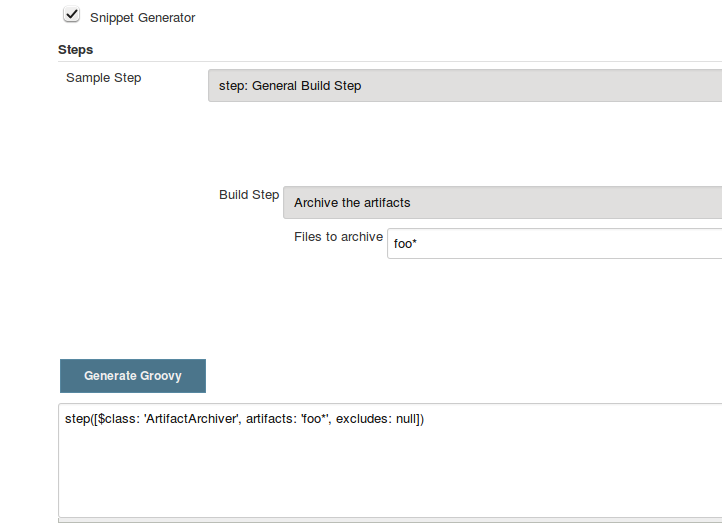
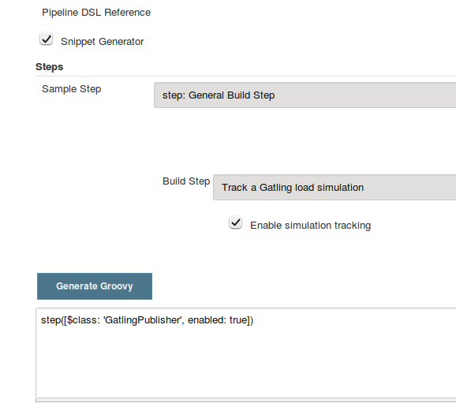
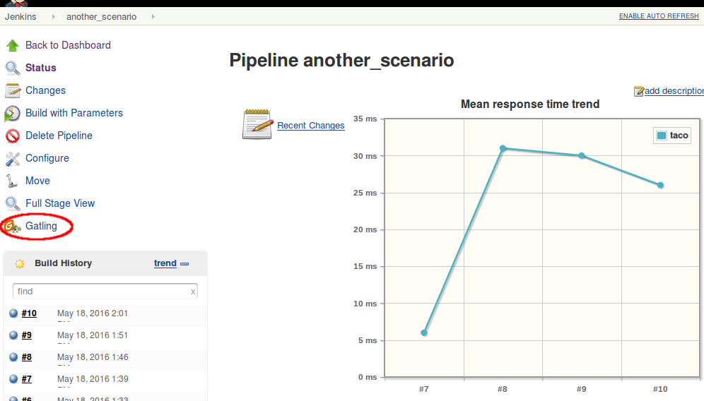

NOTE: _This is a guest post by [Chris Price](https://github.com/cprice404).
Chris is a software engineer at [Puppet](http://puppet.com), and has been
spending some time lately on automating performance testing using the latest
Jenkins features._

## Adventures in Jenkins plugin development: Pipeline refactoring edition

In this blog post, I'm going to attempt to provide some step-by-step notes on how to refactor an existing Jenkins plugin to make it compatible with the new Jenkins Pipeline jobs.  Before we get to the fun stuff, though, a little background.

### How'd I end up here?

Recently, I started working on a project to automate some performance tests for my company's products.  We use the awesome [Gatling](http://gatling.io/#/) load testing tool for these tests, but we've largely been handling the testing very manually to date, due to a lack of bandwidth to get them automated in a clean, maintainable, extensible way.  We have a years-old Jenkins server where we use the [gatling jenkins plugin](https://wiki.jenkins-ci.org/display/JENKINS/Gatling+Plugin) to track the history of certain tests over time, but the setup of the Jenkins instance was very delicate and not easy to reproduce, so it had fallen into a state of disrepair.

Over the last few days I've been putting some effort into getting things more automated and repeatable so that we can really maximize the value that we're getting out of the performance tests.  With some encouragement from the fine folks in the #jenkins IRC channel, I ended up exploring the [JobDSL plugin](https://wiki.jenkins-ci.org/display/JENKINS/Job+DSL+Plugin) plugin and the new [Pipeline jobs](https://jenkins.io/doc/pipeline/).  Combining those two things with some Puppet code to provision a Jenkins server via the [jenkins puppet module](https://github.com/jenkinsci/puppet-jenkins) gave me a really nice way to completely automate my Jenkins setup and get a seed job in place that would create my perf testing jobs.  And the Pipeline job format is just an *awesome* fit for what I wanted to do in terms of being able to easily monitor the stages of my performance tests, and to make the job definitions modular so that it would be really easy to create new performance testing jobs with slight variations.

So everything's going GREAT up to this point.  I'm really happy with how it's all shaping up.  But then... (you knew there was a "but" coming, right?) I started trying to figure out how to add the Gatling Jenkins plugin to the Pipeline jobs, and kind of ran into a wall.  As best as I could tell from my googling, the plugin was probably going to require some modifications in order to be able to be used with Pipeline jobs, but I wasn't able to find any really cohesive documentation that definitively confirmed that or explained how everything fits together.

After a few days of rando n00b mails to the mailing lists, asking dumb questions in IRC, absorbing bits of knowledge from READMEs in various github repos, and just poking at source code, I eventually got it all sorted out.  So, in hopes of saving the next person a little time, and encouraging plugin authors to invest the time to get their plugins working with Pipeline, here are some notes about what I learned.

Spoiler: if you're just interested in looking at the individual git commits that I made on may way to getting the plugin working with Pipeline, have a look at [this github branch](https://github.com/cprice404/gatling-plugin/commits/feature/master/compatibility-with-jenkins-pipeline.individual-commits).

### Creating a pipeline step

The main task that the Gatling plugin performs is to archive Gatling reports after a run.  I figured that the end game for this exercise was that I was going to end up with a Pipeline "step" that I could include in my Pipeline scripts, to trigger the archiving of the reports.  So my first thought was to look for an existing plugin / Pipeline "step" that was doing something roughly similar, so that I could use it as a model.  The Pipeline "Snippet Generator" feature (create a pipeline job, scroll down to the "Definition" section of its configuration, and check the "Snippet Generator" checkbox) is really helpful for figuring out stuff like this; it is automatically populated with all of the steps that are valid on your server (based on which plugins you have installed), so you can use it to verify whether or not your custom "step" is recognized, and also to look at examples of existing steps.

Looking through the list of existing steps, I figured that the `archive` step was pretty likely to be similar to what I needed for the gatling plugin:



So, I started poking around to see what magic it was that made that `archive` step show up there.  There are some mentions of this in the [pipeline-plugin DEVGUIDE.md](https://github.com/jenkinsci/pipeline-plugin/blob/6cffbecd874b924677ce3b3c5b1e0e2f45689cc5/DEVGUIDE.md#build-steps) and the [workflow-step-api-plugin README.md](https://github.com/jenkinsci/workflow-step-api-plugin/blob/ee8f181c5561d70207a6b84b4d91ca24312c8a39/README.md), but the real breakthrough for me was finding the [definition of the `archive` step in the `workflow-basic-steps-plugin` source code](https://github.com/jenkinsci/workflow-basic-steps-plugin/blob/300fe6c02b41f072e50a501cfec3e2f425048446/src/main/java/org/jenkinsci/plugins/workflow/steps/ArtifactArchiverStep.java#L37-L53).

With that as an example, I was able to start poking at getting a `gatlingArchive` step to show up in the Snippet Generator.  The first thing that I needed to do was to [update the `gatling-plugin` project's `pom.xml` to depend on a recent enough version of Jenkins, as well as specify dependencies on the appropriate pipeline plugins](https://github.com/cprice404/gatling-plugin/commit/b321192bc635eee529ff70e4795591c4594f3664).

Once that was out of the way, I noticed that the `archive` step had some tests written for it, using what looks to be a pretty awesome test API for pipeline jobs and plugins.  Based on [those `archive` tests](https://github.com/jenkinsci/workflow-basic-steps-plugin/blob/300fe6c02b41f072e50a501cfec3e2f425048446/src/test/java/org/jenkinsci/plugins/workflow/steps/ArtifactArchiverStepTest.java#L26-L44), I added [a skeleton for a test for the `gatlingArchive` step](https://github.com/cprice404/gatling-plugin/commit/ed9df4b54c36cee467b3a82e42cb2111e93f9df5) that I was about to write.

Then, I moved on to [actually creating the step](https://github.com/cprice404/gatling-plugin/commit/3de3485be591c7b750ec2671e74558a79efc4319).  The meat of the code was this:

```java
public class GatlingArchiverStep extends AbstractStepImpl {
    @DataBoundConstructor
    public GatlingArchiverStep() {}

    @Extension
    public static class DescriptorImpl extends AbstractStepDescriptorImpl {
        public DescriptorImpl() { super(GatlingArchiverStepExecution.class); }

        @Override
        public String getFunctionName() {
            return "gatlingArchive";
        }

        @Nonnull
        @Override
        public String getDisplayName() {
            return "Archive Gatling reports";
        }
    }
}
```

Note that in that commit I also added a `config.jelly` file.  This is how you define the UI for your step, which will show up in the Snippet Generator.  In the case of this Gatling step there's really not much to configure, so my `config.jelly` is basically empty.

With that (and the rest of the code from that commit) in place, I was able to fire up the development Jenkins server (via `mvn hpi:run`, and note that you need to go into the "Manage Plugins" screen on your development server and install the Pipeline plugin once before any of this will work) and visit the Snippet Generator to see if my step showed up in the dropdown:



GREAT SUCCESS!

This step doesn't actually *do* anything yet, but it's recognized by Jenkins and can be included in your pipeline scripts at that point, so, we're on our way, kids!

### The `step` metastep

The step that we created above is a first-class DSL addition that can be used in Pipeline scripts.  There's another way to make your plugin work usable from a Pipeline job, without making it a first-class build step.  This is by use of the `step` "metastep", mentioned in the [pipeline-plugin DEVGUIDE.md](https://github.com/jenkinsci/pipeline-plugin/blob/893e3484a25289c59567c6724f7ce19e3d23c6ee/DEVGUIDE.md#build-steps).  When using this approach, you simply refactor your `Builder` or `Publisher` to extend `SimpleBuildStep`, and then you can reference the build step from the Pipeline DSL using the `step` method.

Whoa, that's a lot of uses of the word "step".  Let's back up a... umm.. step.

In the Jenkins GUI, go to the config screen for a Pipeline job and click on the Snippet Generator checkbox.  Select 'step: General Build Step' from the dropdown, and then have a look at the options that appear in the 'Build Step' dropdown.  To compare with our previous work, let's see what "Archive the artifacts" looks like:

 

From the snippet generator we can see that it's possible to trigger an Archive action with syntax like:

    step([$class: 'ArtifactArchiver', artifacts: 'foo*', excludes: null])

This is the "metastep".  It's a way to trigger any build action that implements `SimpleBuildStep`, without having to actually implement a for-realz "step" that extends the Pipeline DSL like we did above.  In many cases, it might only make sense to do one or the other in your plugin; you probably don't really need both.

For the purposes of this tutorial, we're going to do both.  For a couple of reasons:

1. Why the heck not?  :)  It's a good demonstration of how the metastep stuff works.
2. Because implementing the "for realz" step will be a lot easier if the Gatling action that we're trying to call from our `gatlingArchive()` syntax is using the newer Jenkins APIs that are required for subclasses of `SimpleBuildStep`.

`GatlingPublisher` is the main build action that we're interested in using in Pipeline jobs.  So, with all of that in mind, here's our next goal: get `step([$class: 'GatlingPublisher', ...)` showing up in the Snippet Generator.

The [javadocs for the SimpleBuildStep class](https://github.com/jenkinsci/jenkins/blob/jenkins-1.651.2/core/src/main/java/jenkins/tasks/SimpleBuildStep.java#L51-L66) have some notes on what you need to do when porting an existing `Builder` or `Publisher` over to implement the `SimpleBuildStep` interface.  In all likelihood, most of what you're going to end up doing is to replace occurrences of `AbstractBuild` with references to the `Run` class, and replace occurrences of `AbstractProject` with references to the `Job` class.  The APIs are pretty similar, so it's not too hard to do once you understand that that's the game.  There is some discussion of this in the [pipeline-plugin DEVGUIDE](https://github.com/jenkinsci/pipeline-plugin/blob/893e3484a25289c59567c6724f7ce19e3d23c6ee/DEVGUIDE.md#historical-background).

For the Gatling plugin, my [initial efforts to port the `GatlingPublisher` over to implement `SimpleBuildStep`](https://github.com/cprice404/gatling-plugin/commit/288041c696840ea8eaf21705caf756d3d4bb1f94) only required the `AbstractBuild` -> `Run` refactor.

After making these changes, I fired up the development Jenkins server, and, voila!



So, now, we can add a line like this to a Pipeline build script:

    step([$class: 'GatlingPublisher', enabled: true])

And it'll effectively be the same as if we'd added the Gatling "Post-Build Action" to an old-school Freestyle project.

Well... mostly.

### Build Actions vs. Project Actions

At this point our modified Gatling plugin should work the same way as it always did in a Freestyle build, but in a Pipeline build, it only partially works.  Specifically, the Gatling plugin implements two different "Actions" to surface things in the Jenkins GUI: a "Build" action, which adds the Gatling icon to the left sidebar in the GUI when you're viewing an individual build in the build history of a job, and a "Project" action, which adds that same icon to the left sidebar of the GUI of the main page for a job.  The "Project" action also adds a "floating panel" on the main job page, which shows a graph of the historical data for the Gatling runs.

In a Pipeline job, though, assuming we've added a call to the metastep, we're only seeing the "Build" actions.  Part of this is because, in the last round of changes that I linked, we only modified the "Build" action, and not the "Project" action.  Running the metastep in a Pipeline job has no visible effect at all on the project/job page at this point.  So that's what we'll tackle next.

The key thing to know about getting "Project" actions working in a Pipeline job is that, with a Pipeline job, there is no way for Jenkins to know up front what steps or actions are going to be involved in a job.  It's only after the job runs once that Jenkins has a chance to introspect what all the steps were.  As such, there's no list of Builders or Publishers that it knows about up front to call `getProjectAction` on, like it would with a Freestyle job.

This is where [`SimpleBuildStep.LastBuildAction`](https://github.com/jenkinsci/jenkins/blob/jenkins-1.651.2/core/src/main/java/jenkins/tasks/SimpleBuildStep.java#L81-L97) comes into play.  This is an interface that you can add to your Build actions, which give them their own `getProjectActions` method that Jenkins recognizes and will call when rendering the project page after the job has been run at least once.

So, effectively, what we need to do is to [get rid of the `getProjectAction` method on our `Publisher` class, modify the Build action to implement `SimpleBuildStep.LastBuildAction`, and encapsulate our Project action instances in the Build action](https://github.com/cprice404/gatling-plugin/commit/34d811add49ba7f07149a70000c380aadd2407bc).  The build action class now constructs an instance of the Project action and makes it accessible via `getProjectActions` (which comes from the `LastBuildAction` interface):

```java
public class GatlingBuildAction implements Action, SimpleBuildStep.LastBuildAction {
...
    public GatlingBuildAction(Run<?, ?> build, List<BuildSimulation> sims) {
        this.build = build;
        this.simulations = sims;

        List<GatlingProjectAction> projectActions = new ArrayList<>();
        projectActions.add(new GatlingProjectAction(build.getParent()));
        this.projectActions = projectActions;
    }
...
@Override
    public Collection<? extends Action> getProjectActions() {
        return this.projectActions;
    }
}
```

After making these changes, if we run the development Jenkins server, we can see that after the first successful run of the Pipeline job that calls the GatlingPublisher metastep, the Gatling icon indeed shows up in the sidebar on the main project page, and the floating box with the graph shows up as well:



### Making our DSL step, you know, do something

So at this point we've got the metastep syntax working from end-to-end, and we've got a valid Pipeline DSL step (`gatlingArchive()`) that we can use in our Pipeline scripts without breaking anything... but our custom step doesn't actually do anything.  Here's the part where we tie it all together... and it's pretty easy!  All we need to do is to [make our step "Execution" class instantiate a Publisher and call `perform` on it](https://github.com/cprice404/gatling-plugin/commit/d81229f86a8e3cb0a0496ed2c71b6b94f4707720).  As per the [notes in the pipeline-plugin DEVGUIDE.md](https://github.com/jenkinsci/pipeline-plugin/blob/893e3484a25289c59567c6724f7ce19e3d23c6ee/DEVGUIDE.md#variable-substitutions), we can use the `@StepContextParameter` annotation to inject in the objects that we need to pass to the Publisher's `perform` method:

```java
public class GatlingArchiverStepExecution extends AbstractSynchronousNonBlockingStepExecution<Void> {

    @StepContextParameter
    private transient TaskListener listener;

    @StepContextParameter
    private transient FilePath ws;

    @StepContextParameter
    private transient Run build;

    @StepContextParameter
    private transient Launcher launcher;

    @Override
    protected Void run() throws Exception {
        listener.getLogger().println("Running Gatling archiver step.");

        GatlingPublisher publisher = new GatlingPublisher(true);
        publisher.perform(build, ws, launcher, listener);

        return null;
    }
}
```

After these changes, we can fire up the development Jenkins server, and hack up our Pipeline script to call `gatlingArchive()` instead of the metastep `step([$class: 'GatlingPublisher', enabled: true])` syntax.  One of these is nicer to type and read than the other, but I'll leave that as an exercise for the reader.

### Fin

With that, our plugin now works just as well in the brave new Pipeline world as it did in the olden days of Freestyle builds.  I hope these notes save someone else a little bit of time and googling on your way to writing (or porting) an awesome plugin for Jenkins Pipeline jobs!

