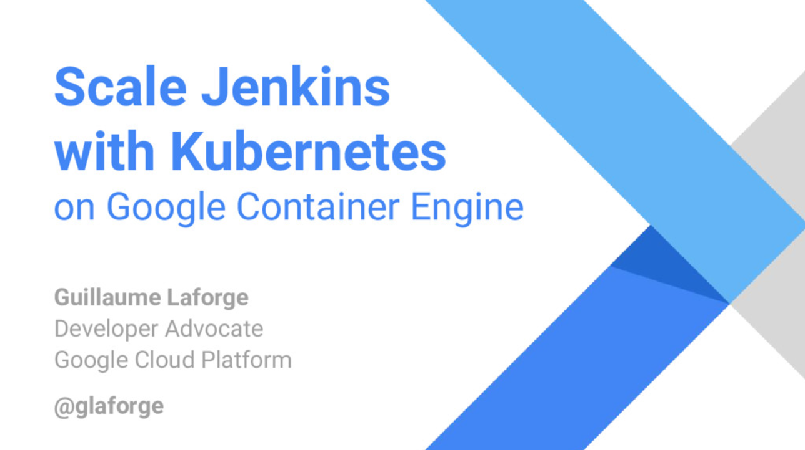

NOTE: This is a guest post by Guillaume Laforge,
Developer Advocate for link:https://cloud.google.com/[Google Cloud]

Last week, I had the pleasure to speak at the 
https://jcd-paris.jfrog.com/[Jenkins Community Day conference], in Paris, 
organized by my friends from https://www.jfrog.com/[JFrog], 
provider of awesome tools for software management and distribution. 
I covered how to scale Jenkins with https://kubernetes.io/[Kubernetes] on 
https://cloud.google.com/container-engine/[Google Container Engine].

For the impatient, here are the slides of the presentation I’ve given:

[link=https://speakerdeck.com/glaforge/scaling-jenkins-with-kubernetes-on-google-container-engine]

But let’s step back a little. In this article, I’d like to share with you why you would want to run Jenkins in the cloud, 
as well as give you some pointers to interesting resources on the topic.

## Why running Jenkins in the cloud?

So why running Jenkins in the cloud? First of all, imagine your small team, working on a single project. 
You have your own little server, running under a desk somewhere, happily building your application on each commit, 
a few times a day. So far so good, your build machine running Jenkins isn’t too busy, and stays idle most of the day. 

Let’s do some bottom of the napkin calculations. Let’s say you have a team of 3 developers, 
committing roughly 4 times a day, on one single project, and the build takes roughly 10 minutes to go.

    3 developers * 4 commits / day / developer * 10 minutes build time * 1 project = 1 hour 20 minutes

So far so good, your server indeed stays idle most of the day. Usually, at most, 
your developers will wait just 10 minutes to see the result of their work.

But your team is growing to 10 persons, the team is still as productive, but the project becoming bigger, 
the build time goes up to 15 minutes:

    10 developers * 4 commits / day / developer * 15 minutes build time * 1 project = 10 hours

You’re already at 10 hours build time, so your server is busy the whole day, and at times, 
you might have several build going on at the same time, using several CPU cores in parallel. 
And instead of building in 15 minutes, sometimes, the build might take longer, or your build might be queued. 
So in theory, it might be 15 minutes, but in practice, it could be half an hour because of the length of the queue 
or the longer time to build parallel projects.

Now, the company is successful, and has two projects instead of one (think a backend and a mobile app). 
Your teams grow further up to 20 developers per project. The developers are a little less productive 
because of the size of the codebase and project, so they only commit 3 times a day. 
The build takes more time too, at 20 minutes (in ideal time). Let’s do some math again:

    20 developers * 3 commits / day / developer * 20 minutes build time * 2 projects = 40 hours

Whoa, that’s already 40 hours of total build time, if all the builds are run serially. 
Fortunately, our server is multi-core, but still, there are certainly already many builds that are enqueued, 
and many of them, perhaps up to 2-3 or perhaps even 4 could be run in parallel. 
But as we said, the build queue increases further, the real effective time of build is certainly longer than 30 minutes. 
Perhaps at times, developers won’t see the result of their developments before at least an hour, if not more.

One last calculation? With team sizes of 30 developers, decreased productivity of 2 commits, 25 build time, 
and 3 projects? And you’ll get 75 hours total build time. You may start creating a little build farm, 
with a controller and several build agents. But you also increase the burden of server management. 
Also, if you move towards a full Continuous Delivery or Continuous Deployment approach, 
you may further increase your build times to go up to deployment, make more but smaller commits, etc. 
You could think of running builds less often, or even on a nightly basis, to cope with the demand, but then, 
your company is less agile, and the time-to-market for fixes of new features might increase, 
and your developers may also become more frustrated because they are developing in the blind, 
not knowing before the next day if their work was successful or not.

With my calculations, you might think that it makes more sense for big companies, with tons of projects and developers. 
This is quite true, but when you’re a startup, you also want to avoid taking care of local server management, 
provisioning, etc. You want to be agile, and use only compute resources you need for the time you need them. 
So even if you’re a small startup, a small team, it might still make sense to take advantage of the cloud. 
You pay only for the actual time taken by your builds as the build agent containers are automatically provisioned 
and decommissioned. The builds can scale up via Kubernetes, as you need more (or less) CPU time for building everything.

And this is why I was happy to dive into scaling Jenkins in the cloud. For that purpose, 
I decided to go with building with containers, with Kubernetes, as my app was also containerized as well. 
Google Cloud offers Container Engine, which is basically just Kubernetes in the cloud.

## Useful pointers ##

I based my presentation and demo on some great solutions that are published on the Google Cloud documentation portal. 
Let me give you some pointers.

* link:https://cloud.google.com/solutions/jenkins-on-container-engine[Overview of Jenkins on Container Engine]
* link:https://cloud.google.com/solutions/jenkins-on-container-engine-tutorial[Setting up Jenkins on Container Engine]
* link:https://cloud.google.com/solutions/configuring-jenkins-container-engine[Configuring Jenkins for Container Engine]
* link:https://cloud.google.com/solutions/continuous-delivery-jenkins-container-engine[Continuous Deployment to Container Engine using Jenkins]
* link:https://github.com/GoogleCloudPlatform/continuous-deployment-on-kubernetes[Lab: Build a Continuous Deployment Pipeline with Jenkins and Kubernetes]

The latter one is the tutorial I actually followed for the demo that I presented during the conference. 
It’s a simple Go application, with a frontend and backend. 
It’s continuously build, on each commit (well, every minute to check if there’s a new commit), 
and deployed automatically in different environments: dev, canary, production. 
The sources of the project are stored in Cloud Source Repository (it can be mirrored from Github, for example). 
The containers are stored in Cloud Container Registry. 
And both the Jenkins controller and agents, as well as the application are running inside Kubernetes clusters in Container Engine.

## Summary and perspective

Don’t bother with managing servers! Quickly, you’ll run out of CPU cycles, 
and you’ll have happier developers with builds that are super snappy!

And for the record, at Google, dev teams are also running Jenkins! 
There was a presentation (https://www.youtube.com/watch?v=7ERV9C20GSE[video] and 
https://www.cloudbees.com/sites/default/files/2016-jenkins-world-jenkins_inside_google.pdf[slides] 
available) given last year by David Hoover at Jenkins World 
talking about how developers inside Google are running hundreds of build agents to build projects on various platforms.
