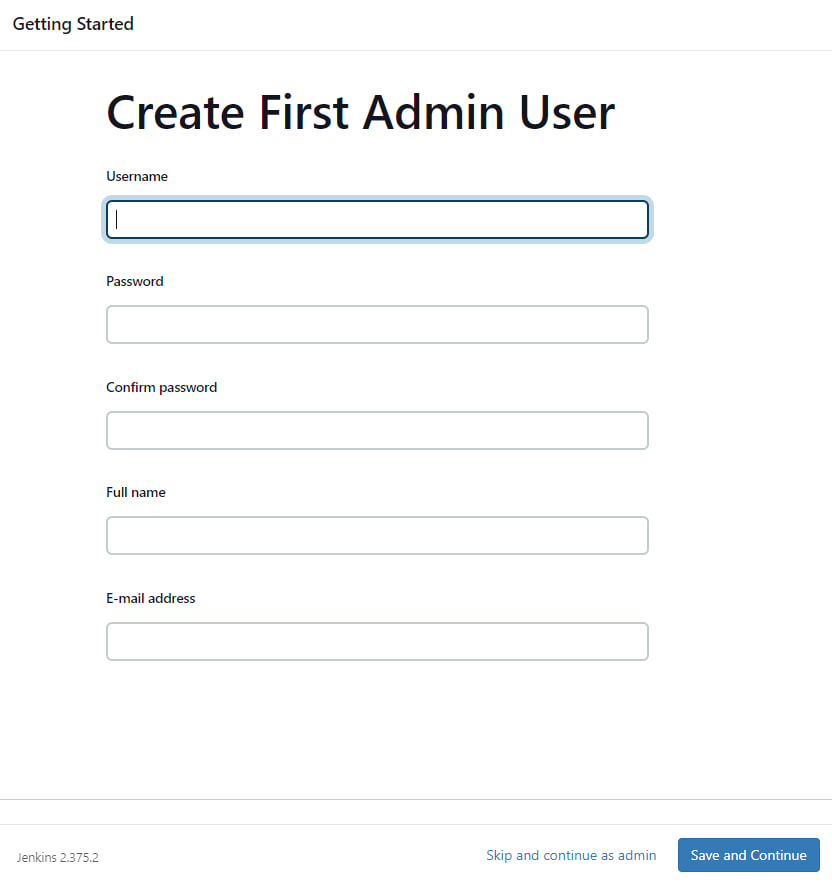
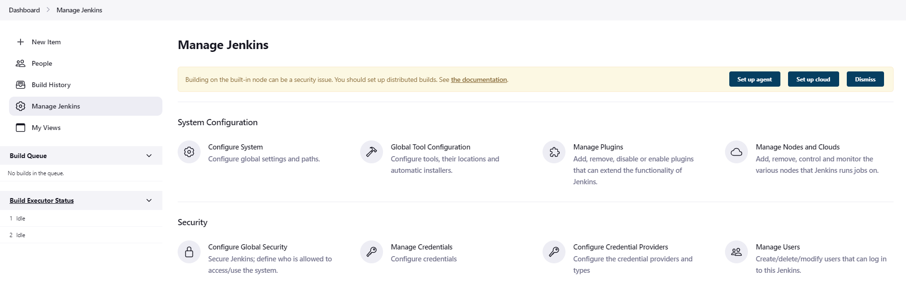
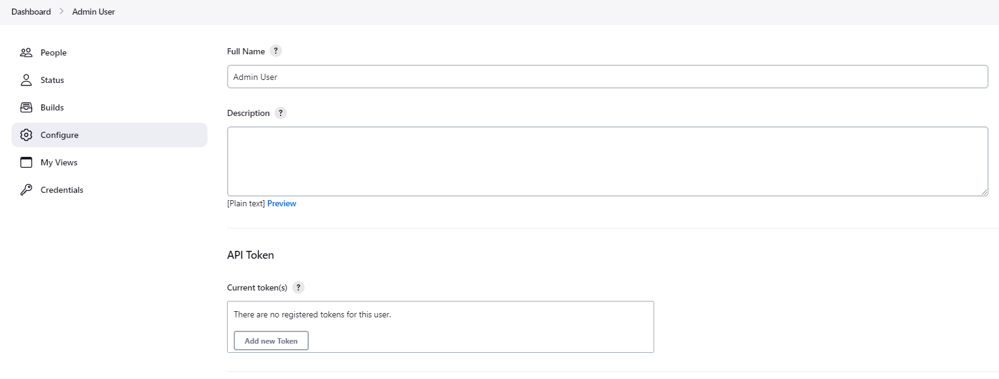

ifdef::backend-html5[]
:notitle:
:description:
:author:
:sectanchors:
:toc:
:hide-uri-scheme:
endif::[]

= Manage Users

== Setting up User Accounts -

As soon as we set up Jenkins in our local computers and go to the required TCP port we set during installation, we get to see the following page where we can enter our details as a first time user

image:blueocean/creating-pipelines/create-a-new-pipeline-box.png['Welcome to Jenkins - Create a New Pipeline message box',width=50%]

== Manage Jenkins -

Once the creation of the user account is done, after filling in the user details, we are all set to use Jenkins.
After signing into Jenkins, there is a navigation pane on the left side of the dashboard with options including the ones shown below.
From here, there are further options within different areas.
From there we will navigate to the *Security* section where we can find the *Manage Users* option.
This option can be utilized to create, delete, or modify details of users that have signed into Jenkins.

== Configure User Details -

After clicking on that option, we can see a list of users and we need to click on the 
user id whose details need to be altered. Now on the left side again we see a "Configure"
option on the left panel.

This section provides multiple options to add/update user details including:

Full Name :: In this option you can update the full name for your Jenkins account.
It is preferred to put your real name in this field for easier identification.

- Description - This option allows you to put up a short introduction of yourself which will be 
displayed on user top page so that visitors can get insights about us. 

- API Token - All registered tokens for the user are displayed here.

- Credentials - 

- E-mail - Users can check their verified email address used for their Jenkins profile. 
You can also use the email address while logging into your Jenkins account.

- Views - 

- Notification URL -

- Password - You can use password along with the email address to login to your Jenkins account. 
Initially it is set to the default temporary password provided to you by Jenkins, 
but you can always change it according to your own choice.

- SSH Public Keys - Pairs of public and private SSH Keys are displayed in this section.

- Session Termination option - You can terminate the current session to start a new one 
later with this option.

- Time Zone - You can choose your nearest timezone to operate your Jenkins account or you can 
also go with the Default time zone that is already set from beginning.
