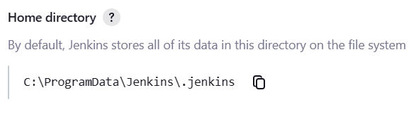

== `JENKINS_HOME` directory
The `JENKINS_HOME` directory is the root of the directory structure on disk that Jenkins uses to perform builds and keep archives.
You can check the location of the JENKINS_HOME directory by following these steps:

* Click Manage Jenkins.

image:../../../images/system-administration/administering-jenkins/manage-jenkins.png[Manage Jenkins]

* Click System.

image:../../../images/system-administration/administering-jenkins/click-system-on-system-config.png[System]

* Check Home directory.

* On Windows By default, this is set to `C:\ProgramData\Jenkins\.jenkins`.
* On Ubuntu By default, this is set to `~/.jenkins`.

But you can change this in one of the following ways:

* Set the `JENKINS_HOME` environment variable
to the location of the new home directory
before launching the servlet container.
* Set the `JENKINS_HOME` system property in the servlet container.
* Set the `JNDI` environment entry `JENKINS_HOME` to the new directory.
See the link:/doc/book/installing/index[Installing Jenkins] for details about how to do this for your container.

You can change this location after you've used Jenkins for a while, too.
To do this:

. stop Jenkins completely.
. Move the contents from the old `JENKINS_HOME` to the new location.
. Set the `JENKINS_HOME` variable to the new location.
. Restart Jenkins.

The directory structure of the `JENKINS_HOME` tree is structured as follows:
[width="100%",cols="100%",]
|===
a|
....
JENKINS_HOME
 +- config.xml     (Jenkins root configuration file)
 +- *.xml          (other site-wide configuration files)
 +- identity.key   (RSA key pair that identifies an instance)
 +- secret.key     (deprecated key used for some plugins' secure operations)
 +- secret.key.not-so-secret  (used for validating _$JENKINS_HOME_ creation date)
 +- userContent    (files served under your https://server/userContent/)
 +- secrets        (root directory for the secret+key for credential decryption)
     +- hudson.util.Secret   (used for encrypting some Jenkins data)
     +- master.key           (used for encrypting the hudson.util.Secret key)
     +- InstanceIdentity.KEY (used to identity this instance)
 +- fingerprints   (stores fingerprint records, if any)
 +- plugins        (root directory for all Jenkins plugins)
     +- [PLUGINNAME]   (sub directory for each plugin)
         +- META-INF       (subdirectory for plugin manifest + pom.xml)
         +- WEB-INF        (subdirectory for plugin jar(s) and licenses.xml)
     +- [PLUGINNAME].jpi   (.jpi or .hpi file for the plugin)
 +- jobs           (root directory for all Jenkins jobs)
     +- [JOBNAME]      (sub directory for each job)
         +- config.xml     (job configuration file)
         +- workspace      (working directory for the version control system)
         +- latest         (symbolic link to the last successful build)
         +- builds         (stores past build records)
             +- [BUILD_ID]     (subdirectory for each build)
                 +- build.xml      (build result summary)
                 +- log            (log file)
                 +- changelog.xml  (change log)
     +- [FOLDERNAME]   (sub directory for each folder)
         +- config.xml     (folder configuration file)
         +- jobs           (subdirectory for all nested jobs)
....
|===

=== Backup and restore
link:/doc/book/system-administration/backing-up/[Backing-up/Restoring Jenkins ]

=== Moving/copying/renaming jobs
You can:

. Move a job from one installation of Jenkins to another by simply copying the corresponding job directory.
. Make a copy of an existing job by making a clone of a job directory by a different name.
. Rename an existing job by renaming a directory. Note that the if you change a job name you will need to change any other job that tries to call the renamed job.

Those operations can be done even when Jenkins is running.
For changes like these to take effect, you must click "reload config" to force Jenkins to reload configuration from the disk.

==== Batch renaming jobs
Replacing spaces in job names with underscores.
[width="100%",cols="100%",]
|===
a|
....
$ rename 's/\s/_/g' *
....
|===

=== Archive unused jobs
Sometimes you want to remove a job from Jenkins but do so in such a way that you can resurrect it later, if the need arises.
You can do this by going to `$JENKINS_HOME` and creating an archive of the job directory.
The following command illustrates how to archive a job 'xyz' and remove it.
[width="100%",cols="100%",]
|===
a|
....
$ cd $JENKINS_HOME/jobs
$ tar czf xyz.tgz xyz
# go to Jenkins GUI "Manage Jenkins" page and "Reload Configuration from Disk"
....
|===
As long as you are not building the Jenkins.
You can do this operation without taking Jenkins offline.
Although you should not build the xyz project while you create an archive.
See also the link:https://plugins.jenkins.io/shelve-project-plugin/["Shelve Project" plugin.]

=== Script Console
Useful for troubleshooting, diagnostics, or batch updates of jobs Jenkins provides a script console that gives you access to all Jenkins internals.
These scripts are written in link:https://groovy-lang.org/[Groovy].

=== URL Options
[width="100%",cols="100%",]
|===
a|
http://[jenkins-server]/[command]
|===
where [command] can be

* exit shutdown jenkins
* restart jenkins
* reload to reload the configuration