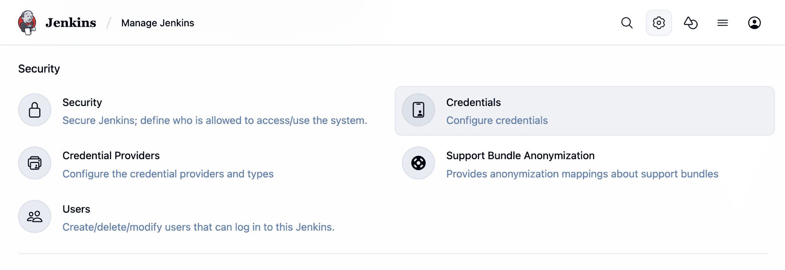

ifdef::backend-html5[]
:description:
:author:
:sectanchors:
:toc:
:toclevels: 4
:hide-uri-scheme:
endif::[]

= Using credentials

There are numerous 3rd-party sites and applications that can interact with
Jenkins, for example, artifact repositories, cloud-based storage systems and
services, and so on.

A systems administrator of such an application can configure credentials in the
application for dedicated use by Jenkins. This would typically be done to "lock
down" areas of the application's functionality available to Jenkins, usually by
applying access controls to these credentials. Once a Jenkins manager (i.e. a
Jenkins user who administers a Jenkins site) adds/configures these credentials
in Jenkins, the credentials can be used by Pipeline projects to interact with
these 3rd party applications.

*Note:* The Jenkins credentials functionality described on this and related
pages is provided by the plugin:credentials-binding[Credentials Binding plugin].

.The correct way to handle credentials in Jenkins
video::yfjtMIDgmfs[youtube,width=800,height=420]

Credentials stored in Jenkins can be used:

* anywhere applicable throughout Jenkins (i.e. global credentials),
  [[types-of-credentials]]
* by a specific Pipeline project/item (read more about this in the
  link:../../pipeline/jenkinsfile#handling-credentials[Handling credentials]
  section of link:../../pipeline/jenkinsfile[Using a Jenkinsfile]),
* by a specific Jenkins user (as is the case for
  link:../../blueocean/creating-pipelines[Pipeline projects created in Blue Ocean]).

Jenkins can store the following types of credentials:

* *Secret text* - a token such as an API token (e.g. a GitHub personal access
  token),
* *Username and password* - which could be handled as separate components or as
  a colon separated string in the format `username:password` (read more about
  this in
  link:../../pipeline/jenkinsfile#handling-credentials[Handling credentials]),
* *Secret file* - which is essentially secret content in a file,
* *SSH Username with private key* - an
  link:http://www.snailbook.com/protocols.html[SSH public/private key pair],
* *Certificate* - a link:https://tools.ietf.org/html/rfc7292[PKCS#12 certificate
  file] and optional password, or
* *Docker Host Certificate Authentication* credentials.

== Credential security

To maximize security, credentials configured in Jenkins are stored in an
encrypted form on the controller Jenkins controller (encrypted by the Jenkins
controller ID) and are only handled in Pipeline projects via their credential IDs.

This minimizes the chances of exposing the actual credentials themselves to
Jenkins users and hinders the ability to copy functional credentials from one
Jenkins controller to another.

== Configuring credentials

This section describes procedures for configuring credentials in Jenkins.

Credentials can be added to Jenkins by any Jenkins user who has the *Credentials
> Create* permission (set through *Matrix-based security*). These permissions
can be configured by a Jenkins user with the *Administer* permission. Read more
about this in the
link:../../managing/security/#authorization[Authorization] section of
link:../../managing/security[Managing Security].

Otherwise, any Jenkins user can add and configure credentials if the
*Authorization* settings of your Jenkins controller's *Security*
settings page is set to the default *Logged-in users can do anything* setting or
*Anyone can do anything* setting.

=== Adding new global credentials

To add new global credentials to your Jenkins controller:

. If required, ensure you are logged in to Jenkins (as a user with the
  *Credentials > Create* permission).
. From the Jenkins home page (i.e. the Dashboard of the Jenkins classic UI),
  click *Manage Jenkins > Manage Credentials*.
+

. Under *Stores scoped to Jenkins* on the right, click on *Jenkins*.
+
image:../../../images/using/stores_jenkins.png[image,title="Store_scoped"]

. Under *System*, click the *Global credentials (unrestricted)* link to access
  this default domain.
+

. Click *Add Credentials* on the left. +
  *Note:* If there are no credentials in this default domain, you could also
  click the *add some credentials* link (which is the same as clicking the *Add
  Credentials* link).
. From the *Kind* field, choose the
  link:#types-of-credentials[type of credentials] to add.
. From the *Scope* field, choose either:
  * *Global* - if the credential/s to be added is/are for a Pipeline
    project/item. Choosing this option applies the scope of the credential/s to
    the Pipeline project/item "object" and all its descendant objects.
  * *System* - if the credential/s to be added is/are for the Jenkins controller
    itself to interact with system administration functions, such as email
    authentication, agent connection, etc. Choosing this option applies the
    scope of the credential/s to a single object only.
. Add the credentials themselves into the appropriate fields for your chosen
  credential type:
  * *Secret text* - copy the secret text and paste it into the *Secret* field.
  * *Username and password* - specify the credential's *Username* and *Password*
    in their respective fields.
  * *Secret file* - click the *Choose file* button next to the *File* field to
    select the secret file to upload to Jenkins.
  * *SSH Username with private key* - specify the credentials *Username*,
    *Private Key* and optional *Passphrase* into their respective fields. +
    *Note:* Choosing *Enter directly* allows you to copy the private key's text
    and paste it into the resulting *Key* text box.
  * *Certificate* - specify the *Certificate* and optional *Password*. Choosing
    *Upload PKCS#12 certificate* allows you to upload the certificate as a file
    via the resulting *Upload certificate* button.
  * *Docker Host Certificate Authentication* - copy and paste the appropriate
    details into the *Client Key*, *Client Certificate* and *Server CA
    Certificate* fields.
. In the *ID* field, specify a meaningful credential ID value - for example,
  `jenkins-user-for-xyz-artifact-repository`. The inbuilt (default) credentials provider
  can use uppercase or lowercase letters for the credential ID, as well as any valid separator character,
  other credential providers may apply further restrictions on allowed characters or lengths.
  However, for the benefit of all users on your Jenkins controller, it is best to
  use a single and consistent convention for specifying credential IDs. +
  *Note:* This field is optional. If you do not specify its value, Jenkins
  assigns a globally unique ID (GUID) value for the credential ID. Bear in mind
  that once a credential ID is set, it can no longer be changed.
. Specify an optional *Description* for the credential/s.
. Click *OK* to save the credentials.
