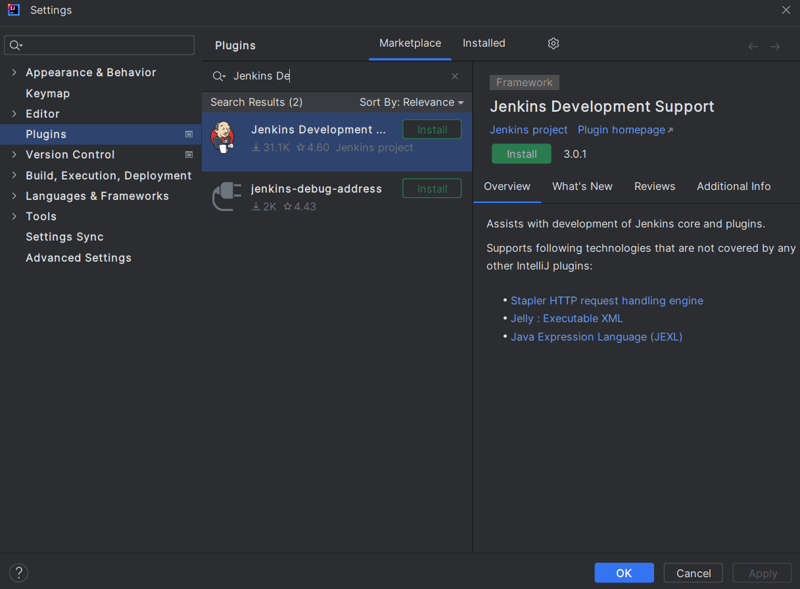

link:/doc/book/using/using-local-language/[How to view Jenkins in your language].

== What plugin developers need to do

== Developer tasks

Developers must do the following to localize a plugin or other module:

. link:/doc/developer/internationalization/i18n-source-code/[Internationalize messages in Java source code]
. link:/doc/developer/internationalization/i18n-jelly-views/[Internationalize messages in Jelly views]
. link:/doc/developer/crowdin/translating-plugins/[Enable Crowdin translation support for the plugin] (Optional)

link:/doc/developer/internationalization/prepare-a-java-source-file/[Prepare a Java source file for localization] shows the detailed internationalization steps.
The link:/doc/developer/internationalization/advanced-localization/[advanced localization] documentation provides guidance for more sophisticated internationalization, like date formatting, time formatting, and number formatting.

== Translator tasks

The Jenkins project always welcomes contributions to translations.
If you are interested in helping us, just file a pull request on GitHub.
In the remainder of this section, we discuss what needs to be translated and how.

[cols="",]
|===
|Remember that properties files must be encoded in link:https://docs.oracle.com/javase/6/docs/api/java/util/Properties.html[ISO 8859-1].
This should be the default anyway.
|===

=== Translation tools

* link:https://wiki.jenkins.io/display/JENKINS/Translation-Tool[Translation Tool] : Command line tool to help translators to generate files, add missing keys, and more.
* link:https://plugins.jenkins.io/translation/[Translation Assistance Plugin] : Adds a dialog box in Jenkins to translate and send missing keys.

=== Translating `+Messages.properties+`

Developers place messages that require localization in `+Messages.properties+`.
Those need to be translated in the usual manner.
See `+Messages_ja.properties+` in the core as an example if you are new to this process.

If looking at `+Messages.properties+` alone does not give you enough contextual information about where the messages are used.
You can access messages with the type-safe `+Messages+` class generated by
link:https://docs.oracle.com/middleware/1212/wls/WLAPI/weblogic/i18n/Localizer.html[Localizer].
To find out where messages are actually used, use your IDE to find all the usages of the message format method.

=== Translating static HTML resources

Stand-alone HTML files are often used in Jenkins for things like inline help messages.
To translate these resources, add the locale code between the file name and the extension.
For example, the Japanese version of `+abc.html+` would be `+abc_ja.html+`, and the British version of it could be `+abc_en_GB.html+`.
These files must be encoded in UTF-8.

=== Pushing changes

After successfully testing the changes interactively, submit a pull request to propose the changes.
Instructions for localization pull requests to Jenkins core are available in the link:https://github.com/jenkinsci/jenkins/blob/master/CONTRIBUTING.md#proposing-changes[Jenkins core contributing guide].
Plugins that use Crowdin for translation can follow the link:/doc/developer/crowdin/translating-plugins/[Crowdin translation instructions].
Plugins that do not use Crowdin for translation should submit a pull request according to the contributing guide for the specific plugin.

When starting a translation, try to check if anyone else is working on the same locale.
You can find out who they are by finding existing localization and looking at its history.
Try to get in touch with them to avoid a surprise.

== Jenkins Development Support plugin for IntelliJ IDEA

Refactoring the existing code to handle i18n correctly is tedious.
So link:https://plugins.jetbrains.com/plugin/1885-jenkins-development-support[IntelliJ IDEA plugin Jenkins Development Support] is developed to simplify this.

// == Stapler plugin for NetBeans
//
// See
// https://github.com/stapler/netbeans-stapler-plugin[NetBeans
// plugin for Stapler] for details.
