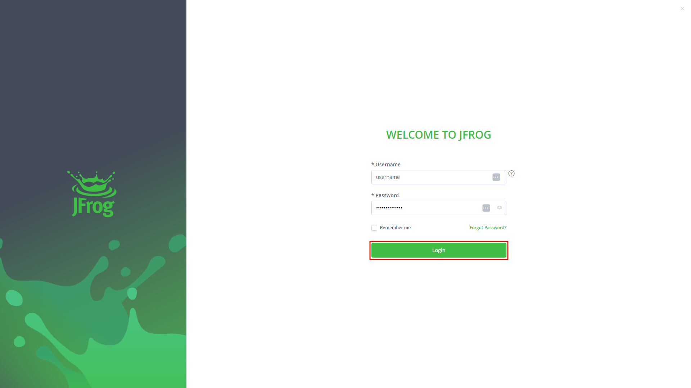
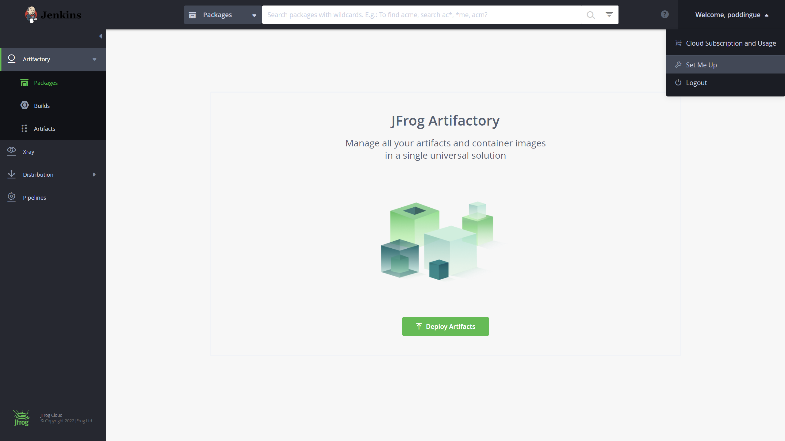
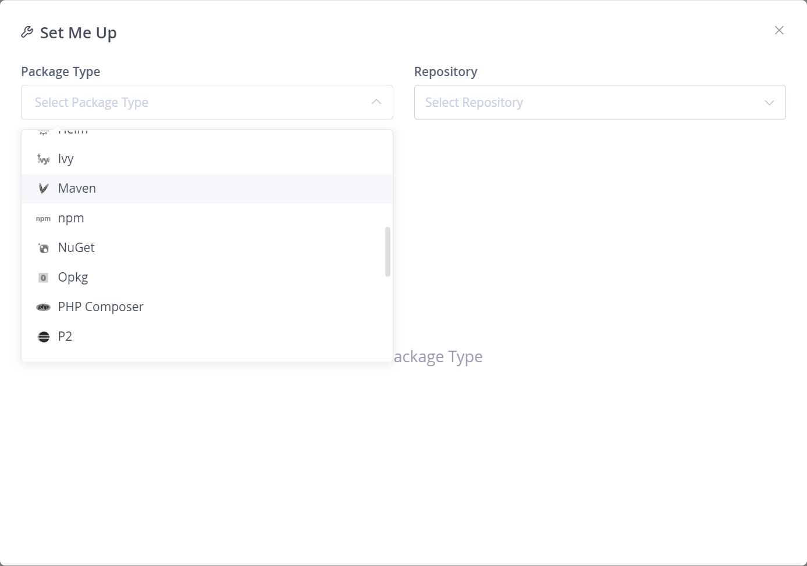
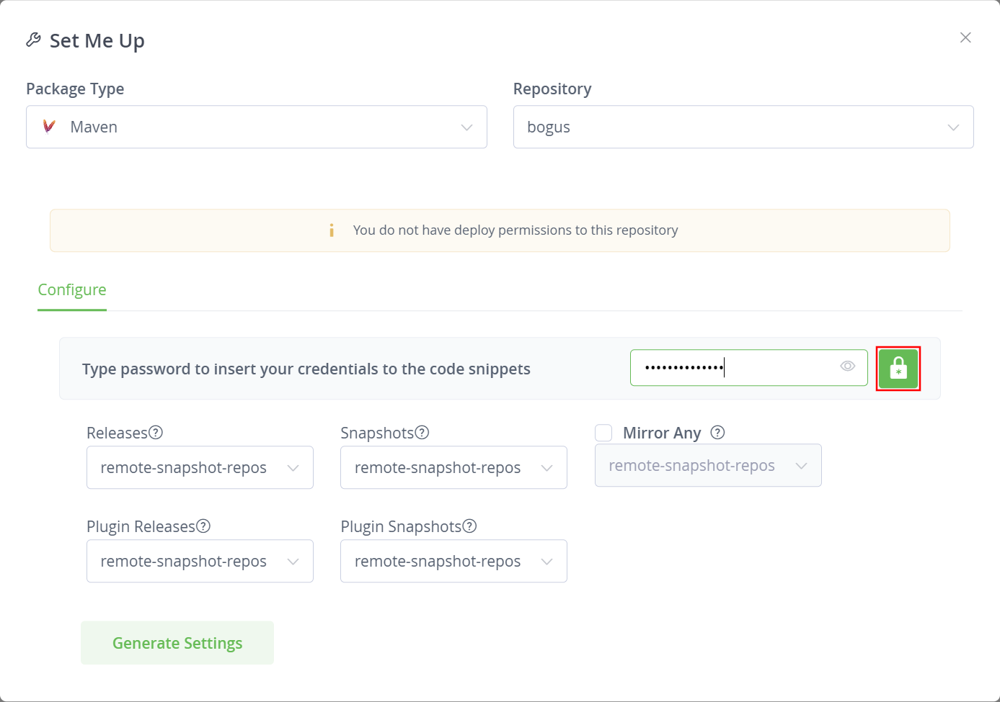
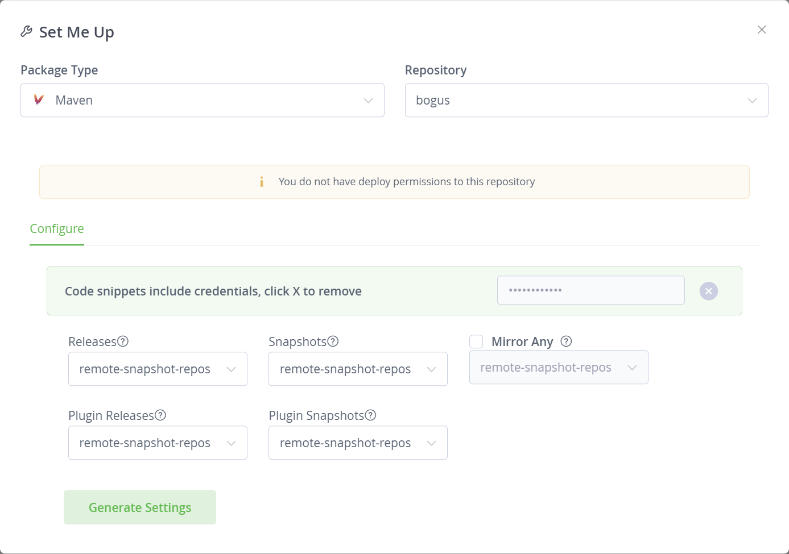
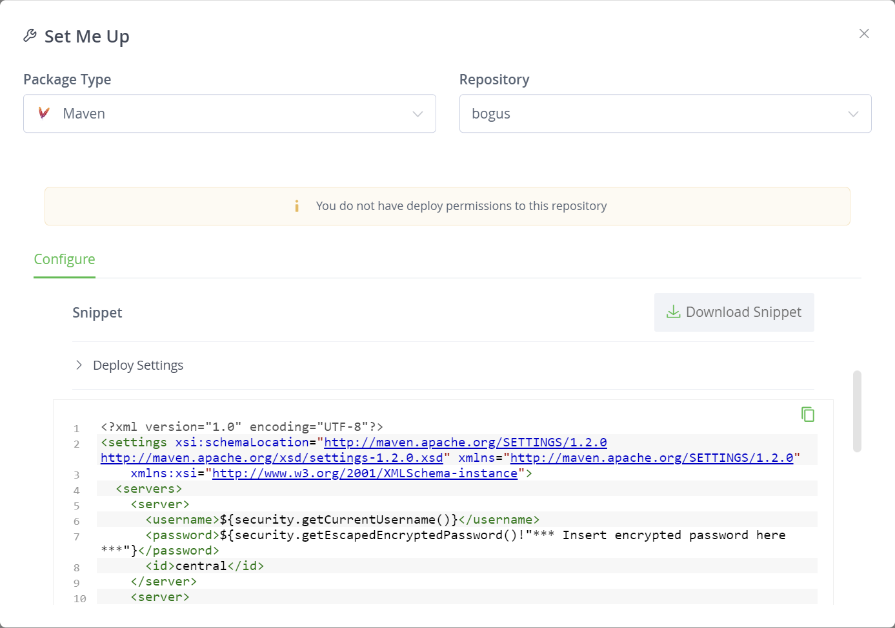
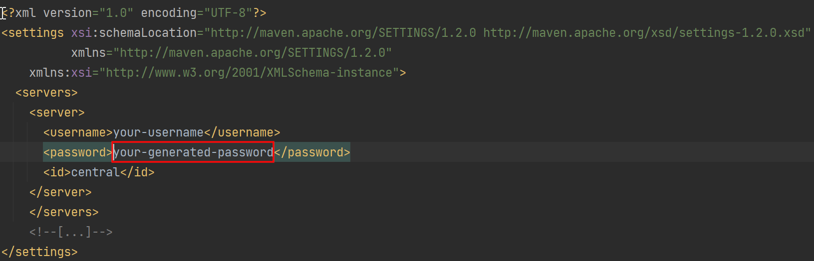

[IMPORTANT]
.Prefer automated releases instead of releasing manually
====
See link:../releasing-cd[setting up automated plugin release] instead of this guide.
====

== Prerequisites

. Make sure you have permissions to release the plugin. link:../requesting-hosting/[See this guide to learn more details]

== Artifactory Credentials for Maven

You will need to tell Maven your credentials to access link:../artifact-repository[Artifactory].
You can obtain your encrypted password from Artifactory using either `curl` or the Artifactory UI.

=== Using the Artifactory UI

Follow these steps to obtain your encrypted password:

1. Log in to Artifactory. 
2. Click your user name on the top right and from the menu select "Set me up". 
3. Select "Maven" as package type (ignore the repository selection and the message about lack of permissions). 
4. Enter your login password below and click the unlock button (big green lock icon). 
5. Click "Generate Settings" at the bottom. 
6. Click "Download Snippet". 
7. Open the downloaded XML file and look for your encrypted password (the `<password>` element).

   Ignore everything else in this file.

NOTE: If your XML snippet says `\*\** Insert encrypted password here \***`, click the unlock button near the password entry field, and re-Generate Settings.

Create the file `~/.m2/settings.xml` (`~` representing your user home directory, e.g. `/home/yourname` or `C:\Users\yourname`) if needed, and make sure it contains the `<servers>` element as shown below:

----
<settings xmlns="https://maven.apache.org/SETTINGS/1.0.0"
  xmlns:xsi="http://www.w3.org/2001/XMLSchema-instance"
  xsi:schemaLocation="https://maven.apache.org/SETTINGS/1.0.0
                      https://maven.apache.org/xsd/settings-1.0.0.xsd">

  <servers>
    <server>
      <id>maven.jenkins-ci.org</id> // <1>
      <username>your_user_name_here</username>
      <password>your_encrypted_password_here</password>
    </server>
  </servers>

</settings>
----
<1> This is not a valid host name anymore, but still the ID used by default in the Jenkins plugin parent POM.
    You may need to add additional `<server>` entries if your plugin POM overrides the inherited Maven `<distributionManagement>`, but this should be rare.

=== Using `curl`

Use this command:

    curl -u your_user_name:your_password https://repo.jenkins-ci.org/setup/settings.xml

This will print the configuration you need to your terminal. You should see something similar to this:
----
$ curl -u mr_jenkins:j3nkinsr0ck5 https://repo.jenkins-ci.org/setup/settings.xml
<settings xmlns="https://maven.apache.org/SETTINGS/1.0.0" xmlns:xsi="http://www.w3.org/2001/XMLSchema-instance" xsi:schemaLocation="https://maven.apache.org/SETTINGS/1.0.0 https://maven.apache.org/xsd/settings-1.0.0.xsd">
  <servers>
    <server>
      <id>maven.jenkins-ci.org</id>
      <username>mr_jenkins</username>
      <password>APrj80t4398w8fnytd498nft4dt8so</password>
    </server>
  </servers>
</settings>
----

Store the output as `~/.m2/settings.xml` (`~` representing your user home directory, e.g. `/home/yourname` or `C:\Users\yourname`), creating the file if it doesn't exist yet.
If you already have this file, merge the `server` block provided in the output with your existing `servers` section, if any, and otherwise add the provided `servers` section to your file.

== Set up GitHub to accept your SSH key

Maven Release Plugin will automatically push to the repository when performing a release, so you need to link:https://help.github.com/articles/adding-a-new-ssh-key-to-your-github-account/[set up GitHub to accept your SSH key].

See the link:https://help.github.com/articles/connecting-to-github-with-ssh/[GitHub help on SSH] for more information.

== Performing the release

Always test your SSH connection before performing a release:

[source,bash]
----
$ ssh -T git@github.com
# Attempts to ssh to GitHub
----

With GitHub and Maven credentials set up, performing a release should be as easy as running the following command:

----
mvn release:prepare release:perform
----

// Not sure about this:
// NOTE: While it is be possible to specify the username and password on the command line, that would require your accounts on GitHub and the Jenkins community to match, and prevent you from using two factor authentication on GitHub.
// Neither is a recommend practice.

== Troubleshooting

First, make sure your plugin uses a reasonably up to date link:../../plugin-development/updating-parent[parent POM].
This will prevent the vast majority of problems in releasing the plugin, such as outdated Maven plugins, or obsolete host names.

=== The upload to the Maven repository fails with "401 Unauthorized"

Unauthorized means that your credentials were invalid, or not sent by Maven.

Make sure you've updated your encrypted password since the last time you changed your password on link:https://accounts.jenkins.io[the account app].

=== The upload to the Maven repository fails with "403 Forbidden"

The two most common explanations for this error:

* You don't have permission to upload to the specified path.
  link:../requesting-hosting/#request-upload-permissions[Learn more about how to request upload permissions].
  Check that the path you're allowed to upload to matches the actual upload attempt (i.e. no typos).
* The specified release already exists and you try to overwrite it.
  We do not allow replacing existing releases.
  Specify a different, previously unused version number during the release process.

=== Further troubleshooting help

If none of the provided solutions help, send an email to the link:/mailing-lists[Jenkins developers mailing list] and explain what you did, and how it failed.
