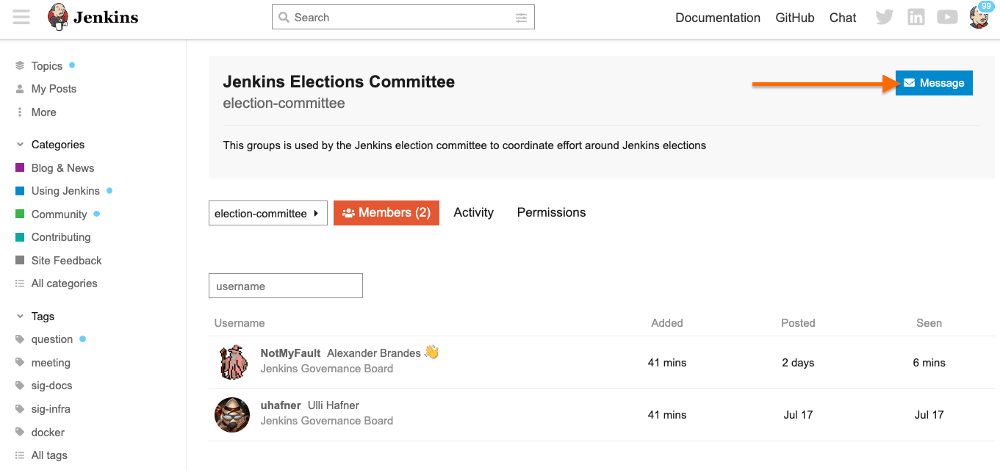
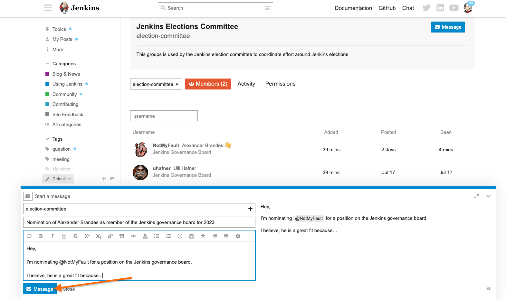
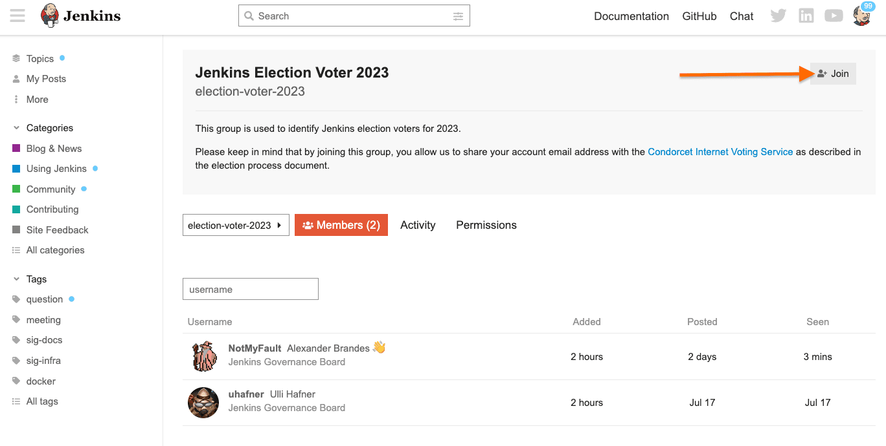
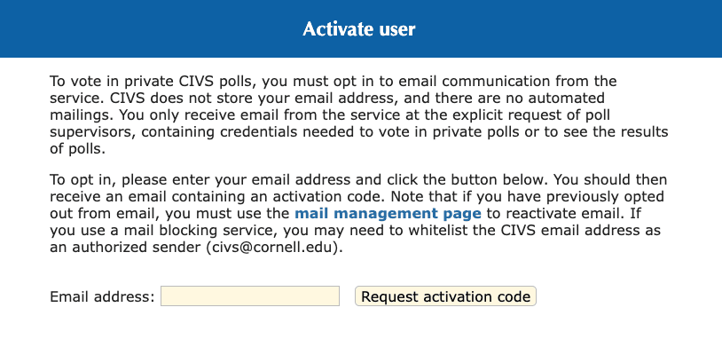
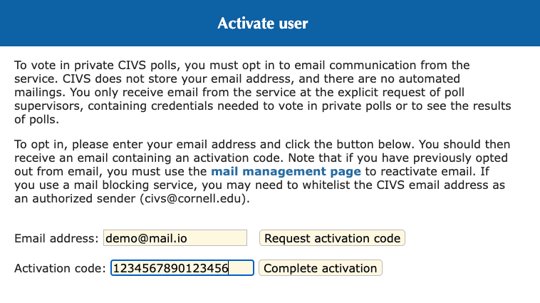
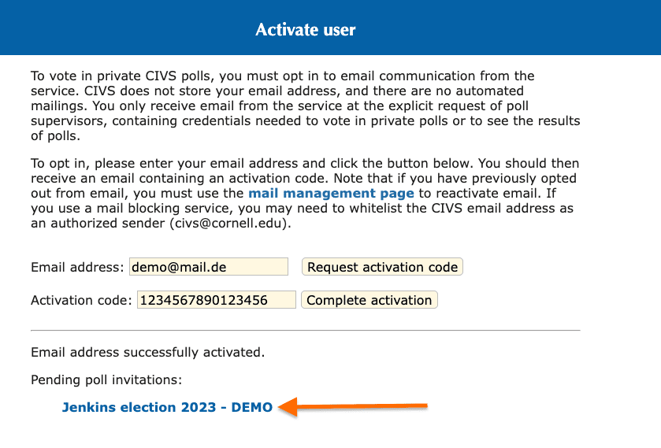
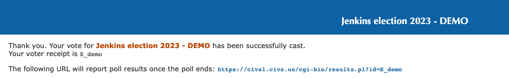

This document outlines, how to nominate and vote for board members and officers, with the different services used during the election.
If you are interested in the election process, please read the link:../board-election-process[Board and Officer election process] and the link:../governance[governance] documents.

This document uses the elections of 2023 in the examples.
The process is the same for all future elections, except for the year.
The election process is driven by the Jenkins Governance board members who are not up for reelection (aka the _election committee_).
In 2023, the election committee consists of link:/blog/authors/notmyfault/[Alexander Brandes] and link:/blog/authors/uhafner/[Ullrich Hafner].

== Election phases

The election process consists of five phases with the following dates:

* Announcement (August 1)
* Nomination of candidates (August 1 - September 15)
* Voter registration (September 16 - October 31)
* Voting (November 1 - November 31)
* Results announcement (December 1)

See the next sections for details about each phase.

== Joining the community forums

Participation in the election process requires registering an account on the link:https://community.jenkins.io/[Jenkins community forums].

If you don't have an account on the Jenkins community forums yet, you can create one by following the link:https://community.jenkins.io/signup[Sign Up] link.
Either create a new account manually, or use your existing GitHub account to sign up.

== Nominating

During the registration period, we invite community members to nominate candidates by sending a message to the link:https://community.jenkins.io/g/election-committee[election-committee] group.

=== Nominate a candidate

Create a new message with the "Message" button.

=== Send the nomination message

Compose the nomination message and send it.
Include the name of the candidate and a brief description of their motivation to run for the board or officer position

You may not receive a response, yet the election committee has registered your nomination.

== Voting

=== Join the annual election group

You can join the annual election group by following the link posted in the annual election announcement and clicking the `Join` button, in the upper-right corner.
The following example shows the joining process:

NOTE: Every year, a new group is created for the election.
If you have participated in the previous election, you need to join the new group!

Joining the group is required to receive the invitation to cast your vote.

=== Activate your CIVS account

To manage elections, the Jenkins project uses the link:https://civs1.civs.us/[Condorcet Internet Voting Service (CIVS)].

If you haven't participated in Jenkins elections before, you need to link:https://civs1.civs.us/cgi-bin/opt_in.pl[activate your account] on the CIVS service manually.
The following example shows the activation process:

NOTE: Ensure `civs@cornell.edu` is not blocked by your spam filter.

Enter your email address used to sign up on the Jenkins community forums and click the `Request activation code` button.
The CIVS service emails you with an activation code.
Enter this code in the `Activation code` field and click the `Complete activation` button:

NOTE: You can activate your account before the voting phase starts and before you receive the invitation to vote, but you don't see any pending poll invitations until the voting phase starts.
If you have activated your account before the voting phase starts, you can proceed to the voting page directly, by following the voting invitation link in the email.
The email is sent to the email address you used to sign up on the Jenkins community forums, once the voting phase starts.

Now that you have activated your account successfully, you can proceed to the voting page, by clicking on the link shown under "Pending poll invitations":

=== Rank the candidates

If you are on the poll site, pay close attention to the poll instructions.
The instructions contain important information about the voting process, the candidates, and how to rank the candidates to cast a vote.

Once you have ranked your choices, click the `Submit ranking` button, at the bottom of the page.

The CIVS service confirms the submission of your vote:

== Troubleshooting

In case you have any issues with the voting process, please contact the link:https://community.jenkins.io/g/election-committee[election committee] group.
